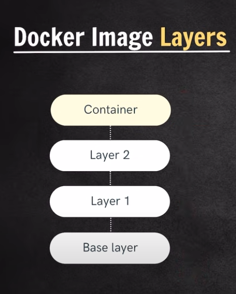
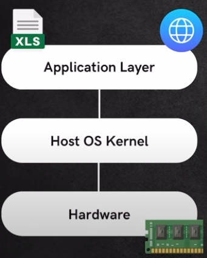
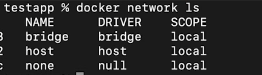
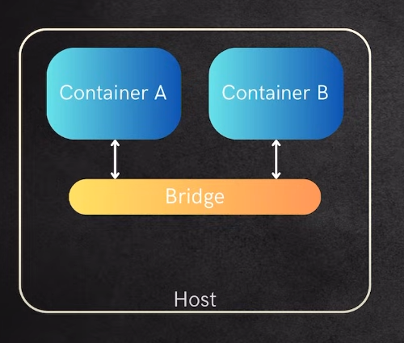

# Docker Learnings

### Docker

1. Docker is a platform which helps us build containers.
2. Container
   1. Container is a single unit where we have packaged our application along with its dependencies
   2. Containers run irrespective of the operating system of the machine
3. Container Properties:
   1. Portable
      1. We share the docker image of our application and that image can be used to build the docker container.
   2. Light Weight
      1. Containers have very less overhead which means it is simple to create the containers, to have multiple containers on a single machine as well as deleting the containers.
      2. The docker container size is smaller to that of a VM.
   3. Seperate env
      1. Containers have their seperate environments irrespective of the host machine.
4. Docker image
   1. Docker image is an executable file.
   2. This file contains instructions to build the container.
   3. The relation between docker image and docker container is similar to that of class and object.
   4. A single docker image can be used to create multiple containers.
   5. We have tags associated with an image. The tags are generally the versions of the image.
5. `docker run -it ubuntu`
   1. Here, it means interactive mode. It means we will run the ubuntu container as well as go inside of it. It means we will be able to get into the container of the ubuntu.
   2. ubuntu is the docker image name that we want the container to be created of.
6. Docker Hub
   1. Docker Hub is the collection of docker images

### Docker Commands

1. `docker pull <image-name>`
   1. If the image does not exist on our local, then it will be pulled from docker hub
   2. By default, the latest version of the image is pulled from the docker hub.
   3. `docker pull <image>:version`
      1. Here, version represents tag associated with the image.
      2. Suppose, 8.0 is the tag associated with the mysql image, `docker pull mysql:8.0`
2. `docker images`
   1. This command is used to list all the docker images that we have in our system
3. `docker run <image-name>`
   1. This command is used to build a container from an image.
   2. The docker gives random names to the containers when run until explicitly specified.
   3. The containers also have a unique id associated with them.
   4. It always create a new container from the image.
4. `docker run -it <image-name>`
   1. This command is used to run the docker container in an interactive mode.
   2. Basically, we will be able to access the ternimal of the container.
5. `docker ps -a`
   1. This gives a list of all the containers on our machine.
   2. `-a` helps in getting all the containers even the exited ones as well.
   3. `docker ps` can be used to output all the running containers on our machine.
6. `docker start <container name/id`>
   1. It is used to restart any existing container.
7. `docker stop <container name/id>`
   1. It is used to stop any existing running container.
8. `docker rmi <image-name/id>`
   1. It is used to remove any image from local.
   2. To delete the image, we need to delete all the containers (running/exited) that we created from it.
9. `docker rm <container name/id>`
   1. It is used to remove any container
10. `docker run -d <image-name>`
    1. Here, -d represents detach mode.
    2. It means to run a container in background.
    3. By default, all containers are run in attach mode.
11. `docker run -e env1=value1 -d <image-name>:tag`
    1. -e is used to define some env variables in a container.
12. `docker run --name <custom-name> -d <image>`
    1. This can be used to give a custom name to the container built from the image.

### Docker Image Layers

1. Any docker image is made up of different layers.  
   
2. There is a Base layer in a docker image.
   1. This generally a small size linux based image like debain, alpine etc
   2. The other layers are available above this layer.
3. We can have multiple layers
4. Container layer:
   1. When we create a new container, a new writable layer (called container layer) is added on top of underlying layers.
5. All layers, except the container layer, are immutable/read only in nature.
6. Now, if we are working with different versions of same image, say img:v1 and img:v2, then there may be some layers which are common. If we have setup one version of the image, say img:v1 and if we try to setup the other version say img:v2, then while setup, for some layers, we get layer already exists.

### Port Binding

1. Whenever a new container is created, by default all containers have some port binded to them. Also, all docker containers have a separate file system.
2. The default port shown by the containers are not the actual ports of the host machine. Lets say, you start 2 containers from mysql image. If you do `docker ps`, it will show port 3306 assigned to both the containers. These are actually the container ports not the host machine ports.
3. We can maually bind the host machine ports to that of container. These are done so if the request comes on that port of the host machine, it will be redirected to the container port.
4. `docker run -p<hostPort>:<containerPort> image_name`
   1. Eg: docker run -p8080:3306 mysql
5. If one of the host port is already in use or binded to some docker container, same port cannot be used by the other container until the port is released.

### Troubleshoot commands

1. `docker logs <container-id>`
   1. Used to access the logs of any container by its id or name.
2. `docker exec -it <container-id/name> /bin/bash`
   1. It is used to execute additional commands on an existingly running container
   2. We can exit from the interactive mode of the container by typing `exit`

### Container vs VM

1. On any machine, we have the following layers:  
   
2. Docker container
   1. Docker uses the host machine kernel and virtualizes the application layer.
   2. Docker has less overhead. Thus, it is light weight.
   3. Docker was initially build for Linux based systems. The majority docker images are linux based images.
   4. Docker desktop adds a lightweight hypervisor layer to a system which internally uses a lightweight linux distribution which helps in running the containers in non linux based syatems. In other words, docker desktop contains a small linux based VM which helps us run a container.
   5. Docker is prefered for running on linux based machines for production env.
3. VM
   1. It vistualizes the host kernel and virtual machine.
   2. VMs are compatible with all underlying OS's because VMs virtualies the host kernel thus it does not matter on which machine we are bringing our VM as it will use its own kernel.

### Docker Network

1. Docker has the ability create some isolated networks inside which if we set up 2 containers then these containers will be able to interact with each other without needing any kind of port or localhost or anything.
2. We need to create a new docker network if we want some container to directly interact with each other.
3. `docker network ls`
   1. This lists all the docker networks available in your system.
   2. Each network has its individual name and id.
4. `docker network create <networkName>`
   1. This will create a new network
5. After creating a new network, we need to run containers inside the network so they can interact with each other.
6. `docker run --network <networkName> -d <image>`
   1. This will create the container in the following network
7. `docker network rm <network-name>`
   1. This command is used to delete a network

### Example

1. Running the docker container for mongo
   1. `docker run -p27017:27017 --name mongo --network mongo-net -e MONGO_INIT_ROOT_USERNAME=admin -e MONGO_INIT_ROOT_PASSWORD=qwerty mongo`
      1. Here we have done port binding, naming of the container, network given, set some env variables for run the container from mongo image

### Docker compose

1. Sometimes we need to run multiple containers of different service to make sure our system works as expected.
2. If we try to run the containers individually through the docker commands then we might make some errors.
3. We can convert all the docker commands in a single file. This file has a `.yaml` extension.
4. Instead of running the containers through terminal, we run them from the docker file.
5. Note: yaml stands for "Yet Another Markup Language"
6. Running containers through a file gives us the following benefits:
   1. Docker commands are in structured format in a docker file.
   2. Edits in the file and again running the containers is easy.
7. The yaml file will run with the help of docker compose.
8. Docker compose is a tool for defining and running multi-container applications.

### Writing the docker compose:

1. Consider the following docker command
   1. `docker run -p27017:27017 --name mongo --network mongo-net -e MONGO_INIT_ROOT_USERNAME=admin -e MONGO_INIT_ROOT_PASSWORD=qwerty mongo-new`
2. Let name the file as `compose.yaml`. Note: Indentation is important in yaml file.
3. In compose.yaml,

   ```yaml
   version: "3.8"

   services:
     mongo-new:
       image: mongo
       ports:
         - 27017:27017
       environment:
         MONGO_INIT_ROOT_USERNAME: admin
         MONGO_INIT_ROOT_PASSWORD: qwerty
   ```

4. Here,
   1. in the above yaml file, at the top we define the docker compose version. We can skip this as well
   2. All the containers in the file are defined under services.
5. Docker compose commands:
   1. `docker compose -f filename.yaml up -d`
      1. This command will start and run the containers defined in the yaml file in detach mode.
   2. `docker compose -f filename.yaml down`
      1. This command will remove the container created from the file.
6. In yaml file, we dont define the network. This is because all the containers written in the yaml file are considered to be belonging to same network.
7. By default, the docker compose will create a new network and then start the containers defined in the yaml file in that network. Hence, all containers will belong to the same network and interact with each other flawlessly.

### Dockerizing own applications

1. Docker file is used to convert our application to docker image.
2. Docker file is a blueprint on how to build our docker image and containers.
3. Docker file contains set of instructions that are run and turn our application into docker image.
4. Important docker file instructions
   1. FROM:
      1. Every docker image that we want to create is based on a base image.
      2. `FROM baseImage`
      3. baseImage can be considered as basic setup and dependencies needed for our application to run
      4. baseImage add an additional layer to our image. baseImage can also have its own baseImage thus adding more layers to our image.
      5. Hence, baseImage adds layers to our image.
   2. WORKDIR:
      1. We define our work directory with this command or the path in the image where files will be copied and commands will be executed.
      2. The further instructions in docker file will be executed in this directory.
   3. COPY:
      1. Copying files and data from the host machine to the image.
      2. We first define file path from host machine and then the path in the image where we want to put the data.
   4. RUN:
      1. This is used to run some instructions in our docker image/container
      2. The docker file can have multiple RUN commands.
   5. CMD:
      1. We can only have a single CMD command in our docker file.
      2. We can consider the CMD command as the one command that will be executed to run the application once a docker container is set up from our docker image
   6. EXPOSE:
      1. We can expose a container port once a container is created from the image.
   7. ENV:
      1. We can define environment variable using this ENV command.
5. `docker build -t imageName:tag directory_of_the_Dockerfile`
   1. Here, -t argument is used to provide a tag to the image.
   2. Eg: In the DemoApp folder, `docker build -t demoapp .` By default, `latest` tag is given to the image, if the tag is not provided.

### Publishing images on docker hub

1. Signup on hub.docker.com
2. Create a repository. It either can be private or public
3. Copy the repo name and that create an image from the docker file with the copied name in your local
4. Login into the docker in the command prompt using `docker login`

### Docker Volumes

1. By default, the virtual file system, where we store data, will loose data if we stop the container.
2. For persisting the data, we use docker volumes
3. Volumes are persistent data stores for containers.
4. In this, we reserve some extra space on our host system to store the data. This extra space is either managed by host system or docker.
5. We mount the space on our container or we can say we establish a connection between the container storage and the extra storage. Whatever data is stored in the container will be replicated in the extra space/volume.
6. Thus, when we stop the container and restart it, the data can be fetched from the extra volume.
7. We can map multiple containers with the same volume.
8. `docker run -v absoluteHostpath:absoluteContainerpath image`
   1. Here, -v argument is used to mount volume to the container.
   2. absoluteHostpath is the path at which you want to create the volumne in the host machine
   3. absoluteContainerPath is the path inside the container which data inside the path will be synched with the volume.
   4. Eg: `docker run -v /Users/abc/Desktop/data:/test/data ubuntu`
9. Docker volumes in docker compose
   1. We add volumes section in services in docker compose.
10. `docker volume ls`
    1. It will list all the volumes created.
11. `docker volume create vol_name`
    1. We can create our custom volume
    2. These are basically named volumes
    3. By default, docker creates the named volumes in the following location
       1. Windows: C:/ProgramData/docker/volumes
       2. Mac/Linux: /var/lib/docker/volumes
    4. These are isolated volumes and we can connect them with some container.
12. `docker volume rm vol_name`
    1. This is used to remove a volume.
13. Attaching volumes to containers
    1. Named volumes:
       1. `docker run -v vol_name:cont_dir`
          1. The vol_name either can be an already created volume or if not, then docker will create a volume with this name first and then map it to the container dir.
          2. Here, docker manages the mount.
    2. Anonymous volumes:
       1. `docker run -v cont_dir`
          1. Here, the docker will automatically create a volume with some name and attach it to the cont_dir.
          2. Here, docker manages the mount.
    3. Bind mount
       1. `docker run -v host_dir:cont_dir`
          1. Here, we bind some localhost directory with the container dir
          2. Here, host OS manages the bind mount.
14. `docker volume prune`
    1. Whenever we have unused volumes means those are not referenced by any container, then we can delete them using this command.
    2. This command generally targets the anonymous volumes.

### Docker network imp concepts

1. Whenever we create some container on our host machine, then by default the container has some kind of network enabled.
2. `docker network ls` will list all the docker networks available in the system.
3. By default, docker creates 3 networks for us:
   1. 
4. All the networks has some drivers attached to them, mainly
   1. bridge
   2. host
   3. null
5. `docker network create <name>`
   1. This creates a new network
   2. Whatever networks we create have a bridge driver attached to it.
6. Bridge network
   1. Whenever we create a new container, by default all containers get attached to bridge  
      
   2. After connecting to the bridge, the containers can inteact with each other on the same host.
   3. By default, all custom network are of bridge until specified externally
   4. Bridges can be of 2 types:
      1. Default Bridge
         1. Containers need port specifications to communicate with each other.
      2. Custom Bridge
         1. Containers dont need any additional port to communicate with each other in case of custom bridges
7. Host network
   1. In this, the container uses the same network as used by our host machine. Thus the container created does not have any Ip address of its own.
   2. It uses the ip address and network used by our host machine.
8. Null network
   1. It is used to create a completely isolated container means the container is isolated from other containers as well as host machine
